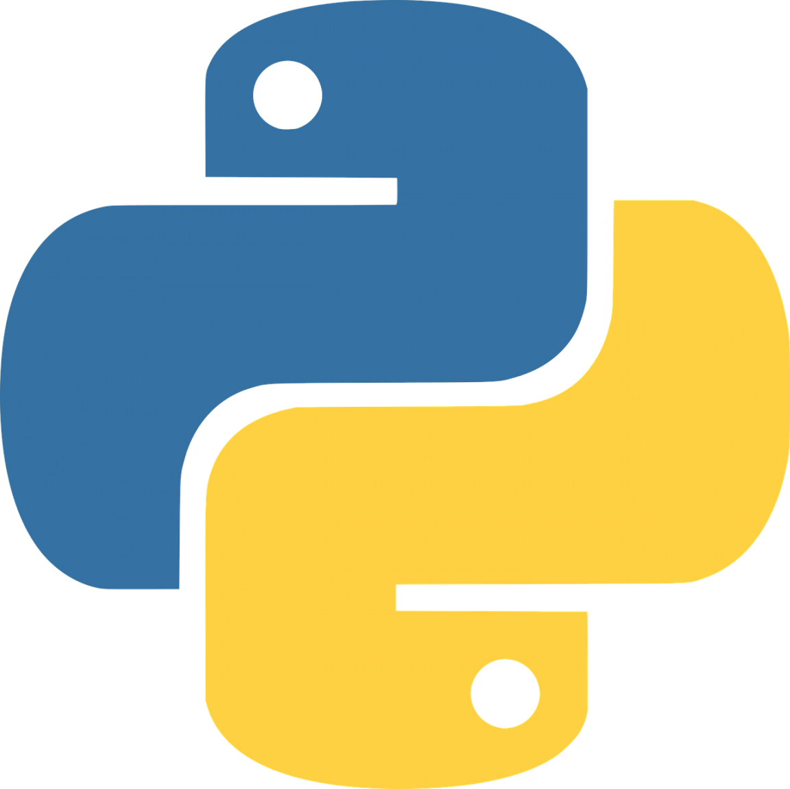

## Hello, I´m L.Antonio Aguilar 👋,
---
### I´m an experimental researcher in Biomechanical engineering. Proudly from Mexico, I´ve been doing biomechanical research since 2010.  One of my life goals is to design robotic devices usefull for human being. Fascinated by everything that can be 3D printed, mechanism design or mathematical models, now I want to learn to code in more and more languages.
---
## About me
- I´m currently learning **FEBio Software** and **Gibbon Software**
- ⚙️ Mastering:  
  

## Interests
- Biomechanics
- Compliant mechanisms
- CFD and FEM simulations

---
## 📬 Get in touch

